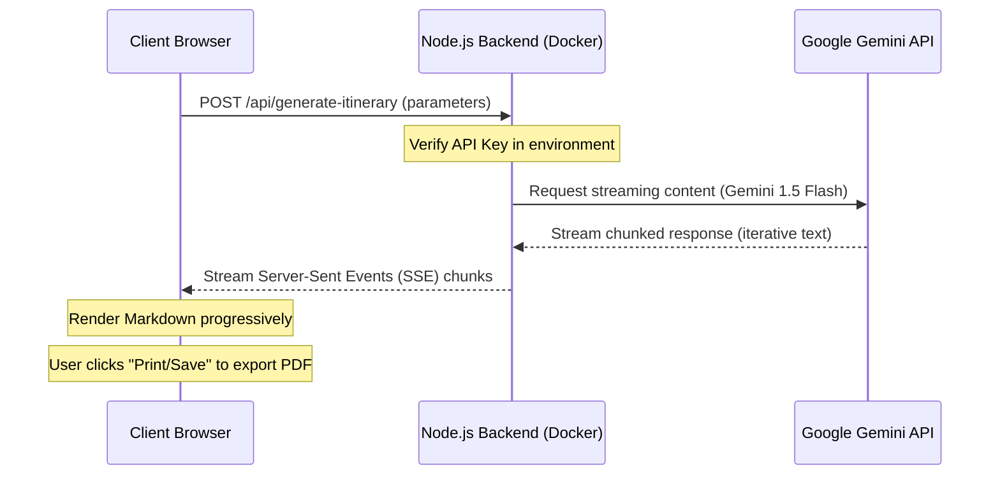

# PROJECT REPORT: TripGuide AI

## 1. Application Overview & Tech Stack
TripGuide AI is a full-stack, containerized AI web application that leverages the power of generative AI to streamline travel itinerary planning.

### Tech Stack
* **Frontend**: HTML5, CSS3 (Clean Minimal Design, custom dark-mode variables, smooth transitions), Vanilla JavaScript (no framework dependencies for lightweight, ultra-fast client-side execution).
* **Backend**: Node.js, Express (lightweight server, SSE/streaming API support, secure backend environment variable handling).
* **AI Engine**: Google Gemini 1.5 Flash via `@google/generative-ai` SDK.
* **Containerization**: Docker (multi-stage lightweight build using `node:20-alpine`).
* **Cloud Infrastructure**: Render.com (automated Docker container hosting with SSL and custom domain).

---

## 2. Prompt Engineering Strategy & Frameworks
To guarantee a high-quality, structured output, the application uses **Structured Role Prompting** with explicit constraints.

### The System Prompt
```javascript
const prompt = `
  You are an expert travel planner and local tour guide. Generate a detailed, engaging travel itinerary based on these details:
  - Destination: ${destination}
  - Duration: ${days} days
  - Budget Tier: ${budget} (e.g. Budget, Moderate, Luxury)
  - Travel Style & Interests: ${interests || "General sightseeing, culture, local food"}

  Requirements:
  1. Provide a catchy, welcoming introduction for the trip.
  2. For each day, include:
     - A short theme/focus for the day (e.g., "Day 1: Historic Heart of the City").
     - Morning, Afternoon, and Evening activities with brief descriptions.
     - Suggested meal options (breakfast, lunch, dinner) aligned with the budget tier.
  3. Provide a practical packing checklist tailored to the destination and activities.
  4. Provide 3-4 local tips (transportation hacks, cultural etiquette, safety, or budgeting advice).

  Format the output cleanly using standard markdown headings (### for days, - for list items, ** for emphasis) so it can be parsed easily. Avoid raw HTML tags. Start directly with the itinerary introduction.
`;
```

### Prompting Rationale
1. **Persona Injection**: "You are an expert travel planner..." primes the model to output helpful, localized, and welcoming language.
2. **Strict Structure Constraints**: Requesting standard markdown headings (like `###` for days, and `-` for bullet items) enables a simple, deterministic frontend parser to display beautiful HTML headings and lists progressively.
3. **Budget and Style Context**: Mapping budget tiers directly into meal options and local tips ensures the responses are highly relevant (e.g., street food for "Budget" vs Michelin-starred suggestions for "Luxury").

---

## 3. Application Architecture
The architecture is structured to keep API credentials secure on the server side and provide real-time updates.



---

## 4. Phase-by-Phase Development Summary

### Phase 1: Conceptualization & UI Design
* Designed a responsive, glassmorphic dark-mode interface.
* Prioritized high-end aesthetics (Google Fonts "Plus Jakarta Sans", neon glow rings, glowing inputs, and custom SVG icons powered by Lucide).

### Phase 2: Backend Development & SSE
* Set up a Node.js Express server.
* Implemented POST request handling and a stream-generator using `@google/generative-ai`.
* Configured proper headers for SSE stream piping.

### Phase 3: Frontend Streaming Connection
* Configured standard Javascript `fetch` with `ReadableStream` reader.
* Built a lightweight, real-time Markdown parsing engine to convert headers and bullets into structured HTML layout during streaming.

### Phase 4: Containerization
* Packaged the application into a Docker container.
* Wrote `Dockerfile` and `.dockerignore` files, ensuring that only production-ready node modules and assets are deployed.

---

## 5. Challenges & Resolutions

### Challenge 1: LLM Latency & User Fatigue
* **Problem**: Traditional API calls take 10-15 seconds to return the complete response, causing users to believe the site was stuck.
* **Resolution**: Implemented Server-Sent Events (SSE). Chunks are rendered instantly in the browser as they are generated by Gemini.

### Challenge 2: Client-side Markdown Rendering
* **Problem**: Integrating heavy markdown parser libraries (like Marked.js) increases build complexity and bundle sizes.
* **Resolution**: Hand-coded a simple, regex-based streaming markdown parser that updates the DOM instantly using native JS.

---

## 6. Key Learnings & Reflections
* **Vibe Coding Efficiency**: Using AI-assisted tools allowed the entire full-stack application (server, UI, parsing engine, Docker config, and docs) to be built in under 20 minutes.
* **Security Discipline**: Keeping the Gemini API Key completely decoupled from client-side code and loading it securely via server environment variables is a critical cloud development best practice.

---
### Public Deployment URL:
* **Live Deployment Link**: [https://tripguide.onrender.com/](https://tripguide.onrender.com/)
